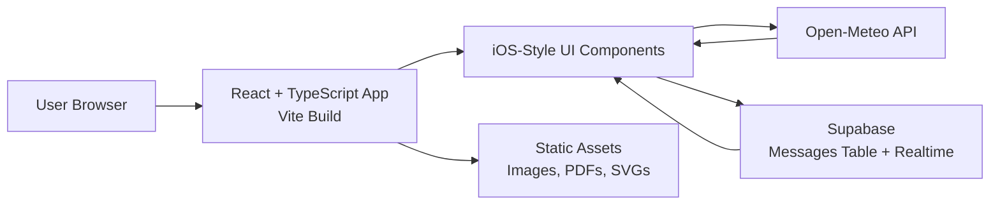
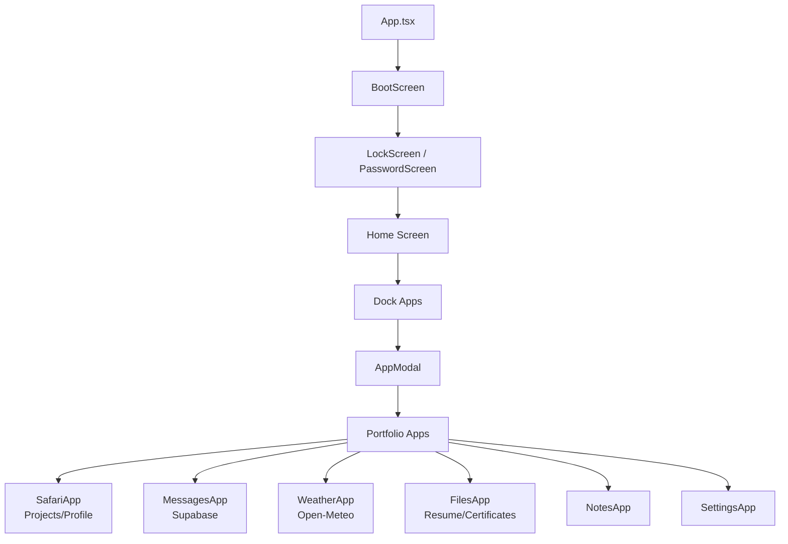
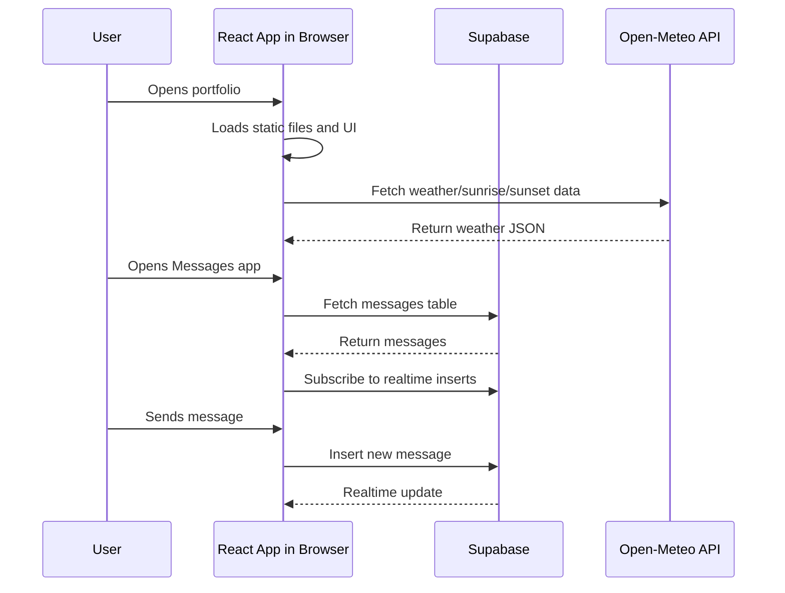
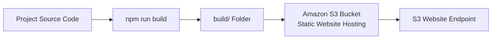
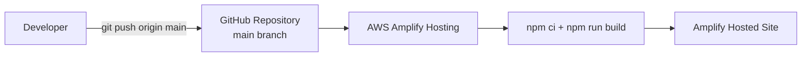
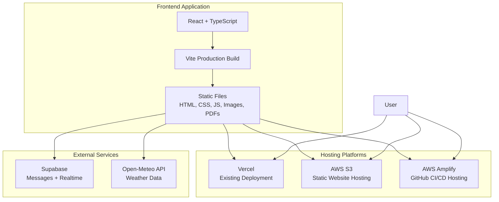

# End-Term Project Presentation

## Slide 1: Title

**Portfolio iOS Style**

An interactive personal portfolio designed as a modern iPhone-style interface.

Presented by: Anshul Chauhan

---

## Slide 2: Project Overview

**Objective**

Build a visually engaging portfolio that presents personal information, projects, skills, certificates, resume, contact options, weather information, and messages through an iOS-inspired user interface.

**Core Idea**

Instead of a normal scrolling portfolio website, the project gives users an interactive smartphone experience with apps, widgets, animations, and modal screens.

---

## Slide 3: Key Features

- iOS-style boot screen and lock screen
- Passcode-based unlock flow
- Home screen with app icons and dock
- Safari-style portfolio/projects view
- Notes, Files, Settings, Music, Calendar, Weather, and Messages apps
- Resume and certificates access
- Live weather data using Open-Meteo API
- Real-time messages using Supabase
- Responsive UI for browser-based viewing

---

## Slide 4: Technology Stack

**Frontend**

- React 18
- TypeScript
- Vite
- Tailwind CSS
- Framer Motion
- Lucide React icons

**External Services**

- Supabase: messages database and real-time updates
- Open-Meteo API: weather and sunrise/sunset data

**Deployment Platforms**

- Vercel: existing production deployment
- AWS S3: static website hosting
- AWS Amplify: GitHub-based CI/CD deployment

---

## Slide 5: Application Architecture



**Explanation**

The browser loads the static React application. Most UI behavior runs on the client side. Static assets such as PDFs, icons, and images are bundled during build. Weather data is fetched from Open-Meteo, while messages are stored and synchronized using Supabase.

---

## Slide 6: Main Component Flow



**Explanation**

The app starts with a boot animation, then shows the lock screen. After unlocking, the user reaches the home screen. App icons and dock icons open different portfolio sections through modal-style app screens.

---

## Slide 7: Data and Service Interaction



**Explanation**

The project does not require a custom backend server. Supabase provides backend-as-a-service functionality for messages, and Open-Meteo provides public weather API data.

---

## Slide 8: Build Process

**Local Build Command**

```bash
npm run build
```

**Build Tool**

Vite compiles the React and TypeScript source code into optimized static files.

**Build Output**

```text
build/
├── index.html
├── assets/
├── Anshul_Resume.pdf
├── wallpaper.png
└── other static files
```

The `build/` folder is the final deployable output.

---

## Slide 9: Deployment Option 1 - Vercel

**Current Existing Deployment**

The project was already deployed on Vercel.

**Vercel Role**

- Connects to GitHub repository
- Builds the Vite app
- Hosts the static frontend
- Provides production URL and custom domain support

**Use Case**

Vercel is used as the existing public deployment and backup production platform.

---

## Slide 10: Deployment Option 2 - AWS S3



**S3 Deployment Steps**

- Run `npm run build`
- Create an S3 bucket
- Enable static website hosting
- Set `index.html` as index document
- Set `index.html` as error document
- Upload all contents inside `build/`
- Open the S3 website endpoint

**Current S3 URL**

```text
http://anshul-portfolio-ios-style-2026.s3-website-us-east-1.amazonaws.com/
```

---

## Slide 11: Deployment Option 3 - AWS Amplify



**Amplify Deployment Flow**

- Connect GitHub repository to AWS Amplify
- Select `main` branch as production branch
- Set build command as `npm run build`
- Set output directory as `build`
- Amplify builds and deploys automatically

**Current Amplify URL**

```text
https://main.d11qc5xscledi5.amplifyapp.com
```

---

## Slide 12: CI/CD With Amplify

**Automatic Redeployment**

Whenever a commit is pushed to GitHub `main`, Amplify automatically redeploys.

```bash
git add .
git commit -m "update portfolio"
git push origin main
```

**Amplify Then Performs**

- Pull latest source code
- Install dependencies using `npm ci`
- Build using `npm run build`
- Publish the latest `build/` output

This makes Amplify the preferred AWS deployment for continuous updates.

---

## Slide 13: Final Deployment Architecture



**Explanation**

The same production build can be hosted on multiple platforms. Vercel remains the existing deployment, S3 demonstrates static hosting on AWS, and Amplify provides AWS-based CI/CD hosting.

---

## Slide 14: Why CloudFront Was Not Used

CloudFront was planned for CDN and HTTPS in front of the S3 website.

However, the AWS Academy/VocLabs account blocked the required IAM action:

```text
cloudfront:CreateDistribution
```

**Conclusion**

CloudFront could not be created due to lab account permissions. In a normal AWS account, CloudFront would be added in front of S3 for HTTPS, CDN caching, and better production delivery.

---

## Slide 15: Why EC2 Was Not Required

EC2 is mainly needed when a project requires a running backend server.

This project is a static frontend application:

- React runs in the browser
- Static files are generated by Vite
- Supabase handles backend data for messages
- Open-Meteo provides weather API data

Therefore, S3 or Amplify is more suitable than EC2 for hosting this project.

---

## Slide 16: Security and Access

**S3**

- Bucket policy allows public read access to static website files
- Only generated frontend files are uploaded
- No server credentials are stored in S3

**Amplify**

- Connected to GitHub repository
- Automatically builds from the selected branch
- Provides HTTPS URL by default

**Supabase**

- Uses browser-accessible anon key
- Data access should be controlled through Supabase table policies

---

## Slide 17: Testing and Verification

**Build Verification**

```bash
npm run build
```

The build completed successfully and generated the `build/` folder.

**Deployment Verification**

- S3 website URL opened successfully
- Amplify deployment status shows deployed
- Amplify URL is live
- Vercel deployment remains available

---

## Slide 18: Challenges Faced

- AWS CloudFront distribution creation was blocked by IAM permissions in the lab account
- S3 static website hosting required correct public access and bucket policy configuration
- AWS routing rules were initially confused with bucket policy, then corrected
- Amplify auto-detected output directory as `dist`, but the project uses `build`

---

## Slide 19: Learning Outcomes

- Learned how Vite converts a React project into static deployable files
- Deployed the same project using multiple hosting platforms
- Configured AWS S3 static website hosting
- Connected GitHub repository to AWS Amplify
- Understood CI/CD deployment through Amplify
- Compared Vercel, S3, Amplify, CloudFront, and EC2 use cases

---

## Slide 20: Conclusion

The project successfully delivers an interactive iOS-style portfolio experience and is deployed through AWS for evaluation.

**Final AWS Deployments**

- S3 static website hosting
- AWS Amplify GitHub-based deployment

**Preferred AWS Deployment**

AWS Amplify is preferred because it provides HTTPS hosting and automatic redeployment whenever changes are pushed to GitHub.

